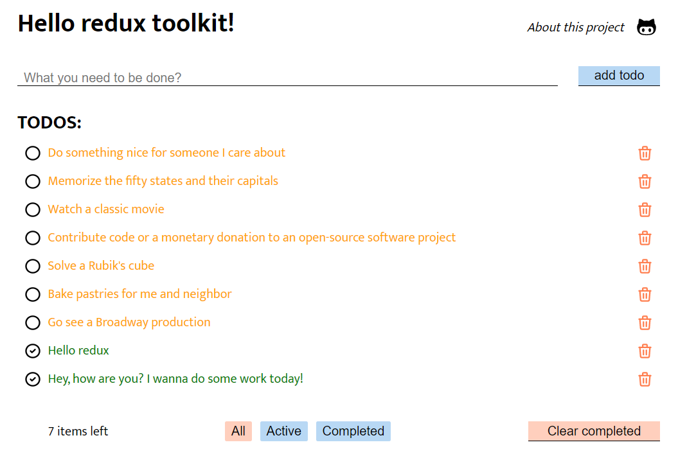
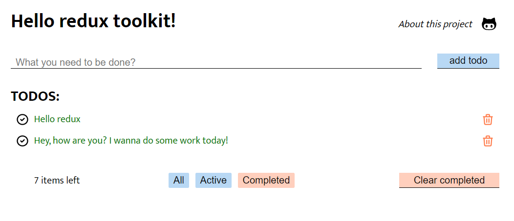

## Project was made by using json-server, so probably you'll need to clone this repo and start it on your own local machine

## just clone and write npm i && npm start to execute all scripts

## you can test all CRUD operations with this todo-example

